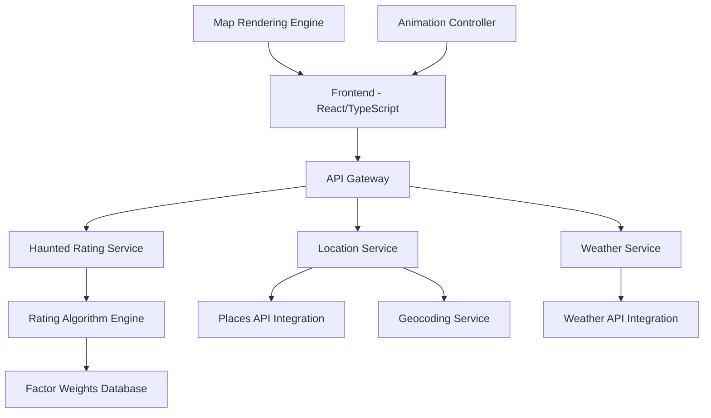

# Ghostbuster Webapp Design Document

## Overview

The Ghostbuster webapp is a single-page web application that combines real-time data integration with an immersive dark-themed mapping interface. The system calculates "haunted ratings" for locations using a weighted algorithm that considers static location characteristics and dynamic environmental factors. The application features smooth animations, real-time data updates, and an atmospheric user experience designed to engage users in exploring spooky locations.

## Architecture

### High-Level Architecture



### Technology Stack

- **Frontend**: React 18 with TypeScript, Vite for build tooling
- **Mapping**: Mapbox GL JS for dark-themed interactive maps
- **Animations**: Framer Motion for smooth transitions and ghost animations
- **State Management**: Zustand for lightweight state management
- **Styling**: Tailwind CSS with custom dark theme
- **Backend**: Node.js with Express.js
- **Data Sources**: OpenWeatherMap API, Google Places API, Mapbox Geocoding

## Components and Interfaces

### Frontend Components

#### 1. App Container
- **Purpose**: Root component managing global state and routing
- **Props**: None
- **State**: Current location, haunted rating, loading states
- **Responsibilities**: Initialize services, handle error boundaries

#### 2. MapInterface Component
- **Purpose**: Interactive dark-themed map with location selection
- **Props**: `currentLocation`, `hauntedRating`, `ghostVisualizations`
- **State**: Map instance, zoom level, animation state
- **Key Methods**:
  - `animateToLocation(coordinates)`: Smooth zoom and pan animation
  - `renderGhostVisualizations(rating)`: Display ghost elements based on rating
  - `handleLocationClick(coordinates)`: Process user map interactions

#### 3. SearchInterface Component
- **Purpose**: Location search and input handling
- **Props**: `onLocationSelect`, `isLoading`
- **State**: Search query, suggestions, input focus
- **Key Methods**:
  - `handleSearch(query)`: Process location search
  - `selectLocation(location)`: Trigger location assessment

#### 4. HauntedRatingDisplay Component
- **Purpose**: Show calculated rating and factor breakdown
- **Props**: `rating`, `factors`, `isExpanded`
- **State**: Expansion state, animation progress
- **Key Methods**:
  - `expandDetails()`: Show factor breakdown
  - `animateRatingChange(newRating)`: Smooth rating transitions

#### 5. GhostVisualization Component
- **Purpose**: Animated ghost elements on the map
- **Props**: `intensity`, `position`, `animationType`
- **State**: Animation frame, opacity, movement path
- **Key Methods**:
  - `startAnimation()`: Begin ghost movement
  - `updateIntensity(rating)`: Adjust ghost density

### Backend Services

#### 1. Haunted Rating Service
- **Endpoint**: `POST /api/rating/calculate`
- **Input**: Location coordinates, timestamp
- **Output**: Haunted rating (0-100), factor breakdown
- **Dependencies**: Weather Service, Location Service, Rating Algorithm

#### 2. Location Service
- **Endpoint**: `GET /api/location/analyze`
- **Input**: Coordinates or place name
- **Output**: Location type, nearby points of interest, geocoded data
- **External APIs**: Google Places API, Mapbox Geocoding

#### 3. Weather Service
- **Endpoint**: `GET /api/weather/current`
- **Input**: Coordinates
- **Output**: Current weather conditions, temperature, visibility
- **External APIs**: OpenWeatherMap API

## Data Models

### Location Model
```typescript
interface Location {
  coordinates: {
    latitude: number;
    longitude: number;
  };
  name: string;
  type: LocationType;
  nearbyPOIs: PointOfInterest[];
  address: string;
}

enum LocationType {
  CASTLE = 'castle',
  ABANDONED_BUILDING = 'abandoned_building',
  FORT = 'fort',
  GRAVEYARD = 'graveyard',
  REGULAR = 'regular'
}
```

### Environmental Factors Model
```typescript
interface EnvironmentalFactors {
  weather: {
    condition: WeatherCondition;
    temperature: number;
    visibility: number;
    precipitation: boolean;
  };
  time: {
    hour: number;
    isNighttime: boolean;
    timezone: string;
  };
  season: Season;
}

enum WeatherCondition {
  CLEAR = 'clear',
  CLOUDY = 'cloudy',
  RAINY = 'rainy',
  FOGGY = 'foggy',
  STORMY = 'stormy'
}

enum Season {
  SPRING = 'spring',
  SUMMER = 'summer',
  AUTUMN = 'autumn',
  WINTER = 'winter'
}
```

### Haunted Rating Model
```typescript
interface HauntedRating {
  overallScore: number; // 0-100
  factors: {
    locationScore: number;
    weatherScore: number;
    timeScore: number;
    seasonScore: number;
  };
  breakdown: FactorBreakdown[];
  calculatedAt: Date;
}

interface FactorBreakdown {
  factor: string;
  weight: number;
  contribution: number;
  description: string;
}
```

## Rating Algorithm

### Calculation Logic

The haunted rating uses a weighted scoring system:

```typescript
const calculateHauntedRating = (location: Location, environmental: EnvironmentalFactors): number => {
  const locationScore = getLocationScore(location.type) * 0.4;
  const weatherScore = getWeatherScore(environmental.weather) * 0.25;
  const timeScore = getTimeScore(environmental.time) * 0.25;
  const seasonScore = getSeasonScore(environmental.season) * 0.1;
  
  return Math.min(100, locationScore + weatherScore + timeScore + seasonScore);
};
```

### Factor Weights

- **Location Type** (40%): Castle (90), Graveyard (85), Abandoned Building (80), Fort (70), Regular (10)
- **Weather** (25%): Foggy (90), Stormy (80), Rainy (70), Cloudy (40), Clear (10)
- **Time** (25%): Midnight-3AM (100), 9PM-Midnight (80), 6PM-9PM (60), Daytime (10)
- **Season** (10%): Autumn (80), Winter (70), Spring (30), Summer (20)

## Error Handling

### API Error Handling
- **Network Failures**: Retry with exponential backoff, fallback to cached data
- **Rate Limiting**: Queue requests, display appropriate user messaging
- **Invalid Locations**: Graceful degradation with default ratings
- **Service Unavailability**: Show error state with retry options

### Frontend Error Handling
- **Map Loading Failures**: Fallback to static map or list view
- **Animation Performance**: Reduce complexity on slower devices
- **Geolocation Errors**: Prompt for manual location entry
- **Browser Compatibility**: Progressive enhancement for older browsers

## Testing Strategy

### Unit Testing
- **Rating Algorithm**: Test calculation accuracy with various input combinations
- **Component Logic**: Test state management and prop handling
- **API Services**: Mock external dependencies and test error scenarios
- **Utility Functions**: Test coordinate transformations and data parsing

### Integration Testing
- **API Integration**: Test real API responses and error handling
- **Map Interactions**: Test location selection and animation triggers
- **Data Flow**: Test complete user journey from search to rating display
- **Performance**: Test animation smoothness and memory usage

### End-to-End Testing
- **User Workflows**: Test complete location assessment process
- **Cross-Browser**: Verify functionality across major browsers
- **Mobile Responsiveness**: Test touch interactions and responsive design
- **Accessibility**: Test keyboard navigation and screen reader compatibility

## Performance Considerations

### Frontend Optimization
- **Code Splitting**: Lazy load map components and animations
- **Asset Optimization**: Compress images and optimize bundle size
- **Animation Performance**: Use CSS transforms and requestAnimationFrame
- **Caching**: Cache API responses and map tiles locally

### Backend Optimization
- **API Response Caching**: Cache weather and location data with appropriate TTL
- **Request Batching**: Combine multiple API calls where possible
- **Database Indexing**: Index frequently queried location data
- **Rate Limiting**: Implement client-side and server-side rate limiting

## Security Considerations

- **API Key Protection**: Store external API keys securely on backend
- **Input Validation**: Sanitize all user inputs and coordinates
- **CORS Configuration**: Restrict cross-origin requests appropriately
- **Rate Limiting**: Prevent abuse of rating calculation endpoints
- **Data Privacy**: Minimize storage of user location data